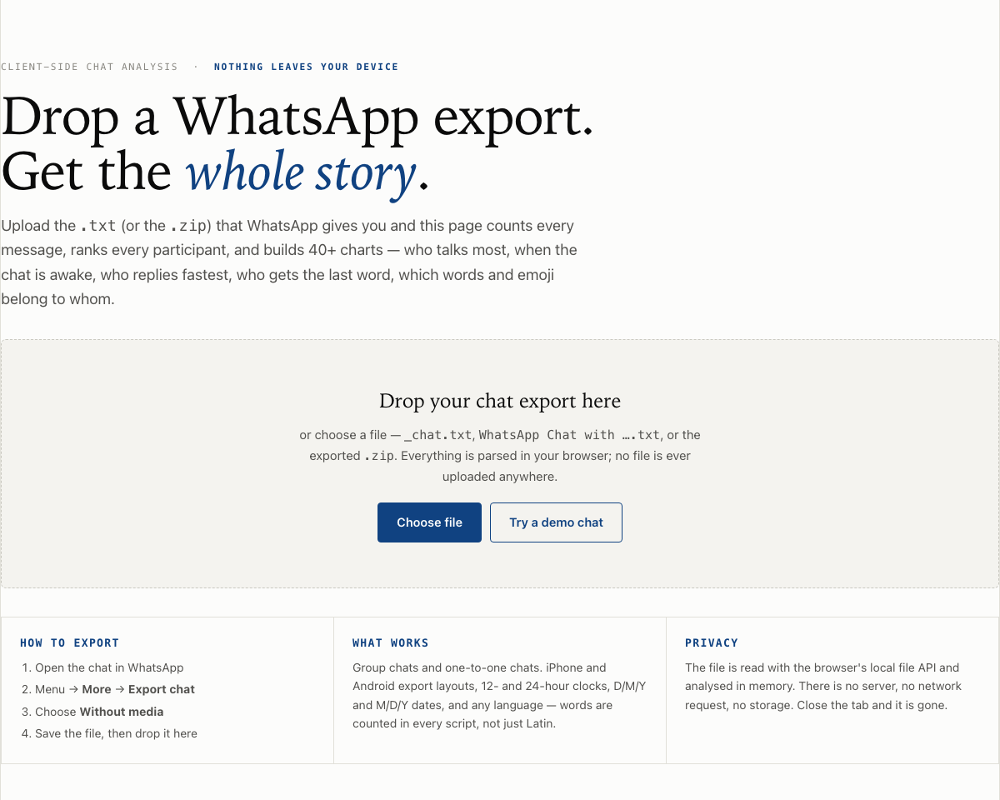
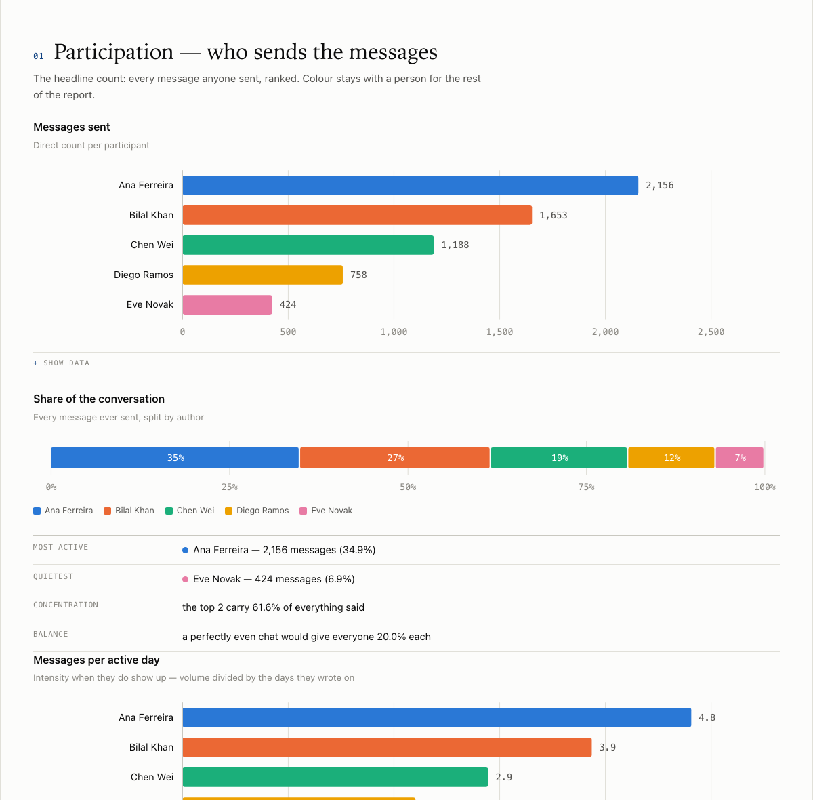
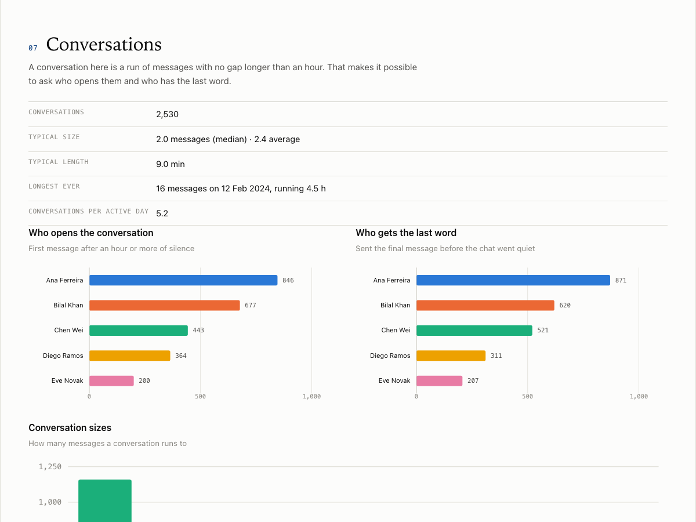
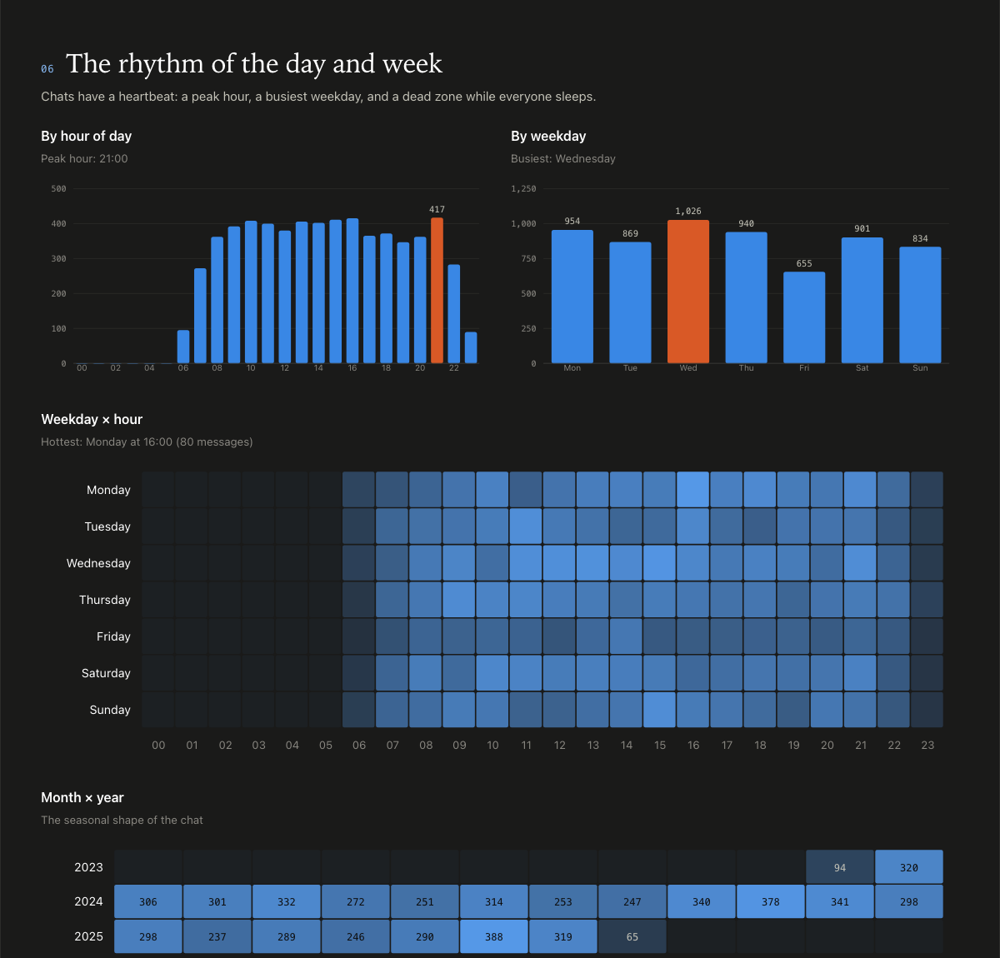

# Chat Autopsy

Drop in a WhatsApp chat export and get the whole story back: who talks, how much, when,
how fast they reply, and what they talk about — about fifty charts and tables, built in
your browser from a single HTML file.

### 🔗 **[Try it Live Here](https://ouseph444.github.io/whatsapp_chat_analysis/)**

No install, no build step, no server, no dependencies. **Your chat never leaves your device.**



---

## Quick start

1. Download [`index.html`](index.html) (that one file is the whole app).
2. Open it in any modern browser — double-click is enough.
3. Drag your exported chat onto the page, or press **Choose file**.

No export handy? Press **Try a demo chat** — the page generates a synthetic conversation so
you can look around first. Every screenshot in this README uses that demo data.

To put it online, enable GitHub Pages (**Settings → Pages → Deploy from a branch → `main` / root**)
and link to `whatsapp_analyzer.html`. It is a static file; Pages needs nothing else.

### Getting the export out of WhatsApp

Open the chat → **⋮ / chat name → More → Export chat → Without media**. You will get a
`.txt` file, or a `.zip` containing one. Both work — the page unzips it for you.

*Without media* keeps the file small: exports store photos and voice notes as placeholder
lines like `image omitted`, which is all the counts need.

---

## What you get



Fourteen sections, each with charts, direct labels, hover tooltips and a **Show data**
table underneath:

| # | Section | Answers |
|---|---------|---------|
| 01 | **Participation** | Who sends the messages, share of the chat, messages per active day |
| 02 | **Words & length** | Talkers vs. writers: words, words per message, median length, vocabulary richness, longest messages |
| 03 | **Message types** | Text, photos, voice notes, stickers, video, documents, locations, polls, deletions — per person |
| 04 | **Over time** | Messages per year, per month, per day with a 30-day average, who dominated each month, active members per month |
| 05 | **Calendar** | A square per day, per year — the chat's silences and streaks at a glance |
| 06 | **Day & week** | Peak hour, busiest weekday, weekday × hour and month × year heatmaps, each person's clock, night owls, early birds, weekend people, estimated sleep windows |
| 07 | **Conversations** | Threads split by hour-long silences: how many, how long, who opens them, **who gets the last word** |
| 08 | **Who answers whom** | A who-follows-whom matrix, median and 90th-percentile reply times, instant replies, messages per turn, name-dropping |
| 09 | **Tone** | Laughter, questions, exclamations, ALL-CAPS, emoji positivity, deleted and edited messages |
| 10 | **Emoji** | Intensity per person, the chat's top 20, everyone's favourites, who uses which |
| 11 | **Vocabulary** | Most-used words, a word cloud, signature words (frequent for one person, rare for the rest), top two-word phrases, writing systems |
| 12 | **Links** | Who shares links, and where they point |
| 13 | **Records** | Busiest days, longest daily streak, longest silence, first and last message, group renames and joins |
| 14 | **Everyone** | A profile card per person, plus a ranked profile matrix |



Light and dark themes are both designed; the page follows your system setting and the
**◐ Theme** button overrides it.



---

## Privacy

The chat is read with the browser's local `File` API and analysed in memory. There is no
server, no network request, no analytics, no `localStorage`. Close the tab and it is gone.
You can verify this by opening the file in an editor — it is one self-contained document
with no external references — or by disconnecting from the internet before you use it.

If you fork this repo, **do not commit your exports.** The included `.gitignore` already
excludes `*_chat*.txt`, `WhatsApp Chat with*.txt`, `*.zip`, generated reports and
`report_data.json`.

---

## Compatibility

| | Supported |
|---|---|
| Export layouts | iPhone `[03/07/2024, 12:20:43 PM] Name: text` and Android `03/07/2024, 12:20 - Name: text` |
| Clocks | 12-hour (AM/PM, including the narrow no-break space WhatsApp uses) and 24-hour |
| Dates | `D/M/Y` and `M/D/Y`, auto-detected, with a manual override in the toolbar; 2- and 4-digit years; `/`, `-` or `.` separators |
| Chats | Groups and one-to-one |
| Languages | Any — words are tokenised with Unicode letter properties, so Malayalam, Hindi, Arabic, Tamil, Cyrillic or CJK count exactly like Latin. A "writing systems" table breaks down which script each person types in |
| Files | `.txt`, or the `.zip` straight from the phone (unzipped in-browser with `DecompressionStream`) |
| Browsers | Anything current: Chrome, Edge, Safari 16.4+, Firefox 113+ |

Multi-line messages, media placeholders in several locales, edited and deleted messages,
system notices and Meta AI replies are all handled. Notices (group created, renamed, people
added or removed, pins) are identified **structurally** — a line with no sender, or a sender
that only ever produces notices — never by wording, so an ordinary message that happens to
say "added" or "left" is not miscounted.

---

## How it works

One file, four layers, no dependencies:

1. **Parser** — two regexes for the two export layouts; continuation lines fold into the
   previous message; invisible LTR/RTL marks are stripped; date order is inferred from the
   data (any day > 12 settles it) and can be overridden.
2. **Analysis** — a single pass builds per-person and global aggregates, then a sequence
   pass derives replies, conversations, turn-taking and the who-follows-whom matrix.
   Roughly 35,000 messages analyse in well under a second.
3. **Chart kit** — hand-rolled SVG: horizontal and vertical bars, stacked and grouped bars,
   100% stacks, area and line charts, small multiples, heatmaps, a contribution calendar,
   histograms and a spiral word cloud, all with a shared tooltip layer.
4. **Report** — sections assembled into a sticky-nav document with a scroll-spy.

Colours come from a palette validated for colour-vision deficiency in both themes. A
person keeps the same colour in every chart, bars carry direct value labels, and every
chart has a table view — so nothing depends on colour alone.

---

## Repository layout

```
whatsapp_analyzer.html      the app — this is the whole thing
docs/                       screenshots used by this README (demo data only)
notebook/
  build_notebook.py         generates the Jupyter notebook below
  build_report.py           turns an executed notebook into one standalone HTML report
  whatsapp_chat_analysis.ipynb   the same analysis in pandas + matplotlib
```

## The notebook (optional)

The original analysis lives in a 15-section Jupyter notebook — useful if you would rather
work in pandas, or want a static report with matplotlib figures.

```bash
pip install pandas matplotlib numpy nbformat nbconvert jupyter emoji wordcloud markdown

cd notebook
cp /path/to/your/_chat.txt .          # the notebook reads ./_chat.txt

jupyter notebook whatsapp_chat_analysis.ipynb          # explore interactively
# …or run the whole thing and build the static report:
jupyter nbconvert --to notebook --execute --inplace whatsapp_chat_analysis.ipynb
python build_report.py whatsapp_chat_analysis.ipynb report_data.json chat_report.html
```

`emoji` and `wordcloud` are optional — the notebook falls back to a regex and skips the
clouds if they are missing. Executing the notebook also writes `report_data.json`, the
headline numbers, so the notebook and the report can never disagree.

In a big group the ranked tables list everyone, while per-member panels and stacked series
show the eight biggest voices — past that, colours would have to repeat and the panels stop
being readable. The web app does the same, folding the rest into "Other".

Regenerate the notebook itself with `python build_notebook.py` — the `.ipynb` is a build
artefact of that script, which is where its code actually lives.

The notebook shipped here has no stored outputs, on purpose: outputs would contain the
messages of whoever you analysed.

---

## Method & caveats

- **Participation is message count.** Reactions are not in WhatsApp exports, so someone who
  mostly reacts with ❤️ looks quieter here than they are.
- **Media are placeholders.** Counts are exact; the content is not in the file.
- **Replies are inferred from sequence** — exports drop WhatsApp's quote metadata. A reply is
  a message from a different person following someone else's, capped at 6 hours so overnight
  gaps don't distort medians.
- **Conversations** are runs of messages separated by more than 60 minutes of silence.
- **Timestamps are local to the exporting phone**; daylight-saving shifts are not corrected.
- **Tone signals are heuristics.** "Laughter" matches `haha`/`lol`/😂; ALL-CAPS looks at Latin
  letters only; emoji positivity uses a small fixed lexicon. Read them as hints, not verdicts.
- Deleted messages count as a message but contribute no words.

---

## Contributing

Issues and pull requests are welcome — especially export layouts from locales that don't
parse, which are the most likely thing to break. Please attach a **redacted** sample of the
first few lines (a real timestamp shape, fake names and text) rather than a real chat.

## License

MIT — see [LICENSE](LICENSE).
